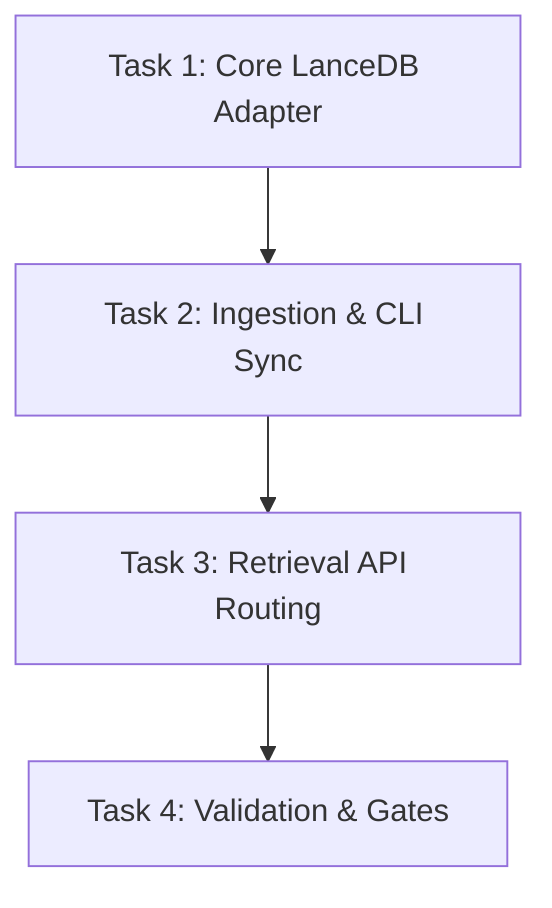

# Backend-Side LanceDB Integration Plan: Architectural Review & Suggestions

This document presents a structured review of the proposed backend-side LanceDB integration plan (`SEARCH_PRODUCT_DIRECTION_CORRECTION_20260601.md`). It identifies potential implementation challenges (such as concurrency, data synchronization, identity keys, and resource optimization) and provides concrete suggestions, corrections, and design details to ensure a robust, production-grade integration.

---

## 1. Key Architectural Suggestions & Corrections

### A. Document Identity: Use `document_id` instead of `source_uri`
* **Observation**: The desktop LanceDB prototype (`lancedb_engine.py`) used `source_uri` (file path) as the primary/unique key for parent documents.
* **Problem**: In a production backend environment, multiple documents might share the same file name or source path (e.g., versioned uploads, duplicate basenames in different virtual directory structures, or documents with different extraction filters). 
* **Correction**: We must use `document_id` (the cryptographic hash generated by the `DocumentProcessor` during ingestion) as the primary key and grouping key in the LanceDB schema. `source_uri` should remain a searchable field and metadata property.
* **Proposed LanceDB Schema**:
  * **`parent_documents` Table**:
    * `document_id` (string, Primary Key/Unique)
    * `source_uri` (string)
    * `aggregated_text` (string)
    * `chunk_count` (int32)
    * `metadata` (string/JSON)
  * **`document_chunks` Table**:
    * `chunk_id` (int64, Unique)
    * `document_id` (string, Foreign Key mapping)
    * `chunk_index` (int32)
    * `text_content` (string)
    * `embedding` (fixed-size vector, e.g., 384 dimensions)
    * `metadata` (string/JSON)

### B. Synchronization Strategy: Dual-Write + Bulk Migration
* **Observation**: The system uses PostgreSQL (`document_chunks` table) as its primary database.
* **Problem**: Adding LanceDB as a search path creates a dual-database setup. We must prevent synchronization drift.
* **Amendment**: Implement a dual-tier synchronization strategy:
  1. **Transactional Dual-Write**: Update the backend `DocumentIndexer` (`indexer_v2.py`) so that indexing operations (`insert_chunks` and `delete_document`) write/delete from both PostgreSQL and LanceDB within the same process flow.
  2. **Migration/Backfill CLI**: Create a tool or admin endpoint (e.g., `python -m tools.sync_lancedb` or `POST /api/v1/admin/lancedb/rebuild`) that reads the existing chunks from PostgreSQL and builds the LanceDB parent/child tables. This allows immediate seeding of existing production data without re-extracting documents.

### C. Concurrency Control in Multi-Worker Web Servers
* **Observation**: LanceDB is an embedded database. It supports concurrent readers but allows only a single writer. 
* **Problem**: The backend FastAPI server runs in a multi-worker process environment (`API_WORKERS=4`). If multiple workers attempt to index or delete documents concurrently, LanceDB write locks will conflict, causing errors.
* **Amendment**:
  * Implement process-safe locking (using a library like `filelock` or Python's `fcntl` on Linux) to serialize write/delete operations across FastAPI workers.
  * Search queries (readers) do not need to acquire locks, maintaining high-throughput concurrent retrieval.

### D. Reusing the Existing Embedding Service
* **Observation**: The desktop engine loaded its own `SentenceTransformerEmbedder`.
* **Problem**: Loading duplicate transformer models inside the web API workers leads to massive RAM overhead and slow application startup.
* **Correction**: The backend LanceDB adapter must not initialize its own embedding model. Instead, it should accept pre-calculated vector embeddings generated by the backend's existing `EmbeddingService` (`embeddings.py`). 
  * During indexing, vectors are already generated for PostgreSQL; these same vectors should be passed directly to LanceDB.
  * During retrieval, the retriever encodes the query once and passes the vector to LanceDB.

### E. Configuration & Storage Locations
* **Amendment**: Add LanceDB settings to `config.py` (e.g., under a new `LanceDBConfig` or within `RetrievalConfig`):
  ```python
  class LanceDBConfig(BaseSettings):
      model_config = SettingsConfigDict(env_prefix='LANCEDB_', case_sensitive=False)
      enabled: bool = Field(default=False, description="Enable LanceDB backend-side search")
      storage_path: str = Field(default="data/lancedb", description="Directory path for LanceDB storage")
      child_parent_spill_ratio: float = Field(default=1.0, description="Parent FTS score threshold ratio for children spill")
  ```

---

## 2. Plan of the First Product Slice

The backend LanceDB integration can be rolled out in three structured tasks:



### Task 1: Core LanceDB Adapter
* **Goal**: Build `lancedb_adapter.py` inside the backend services layer.
* **Details**:
  * Expose an API-free, Postgres-free `BackendLanceDBAdapter` class.
  * Define Arrow schemas for `parent_documents` and `document_chunks` using `pyarrow`.
  * Support `upsert_document(document_id, source_uri, text_chunks, embeddings, metadata)`.
  * Support `delete_document(document_id)`.
  * Implement `search_parent_child(query_vector, query_text, parent_limit, child_limit, spill_ratio)`.

### Task 2: Ingestion Dual-Write & Sync CLI
* **Goal**: Integrate the adapter with the indexing pipeline.
* **Details**:
  * Update `DocumentIndexer.index_document` to write to the LanceDB adapter after successful PostgreSQL insertion.
  * Update `DocumentIndexer.delete_document` to delete from the LanceDB adapter.
  * Create `scripts/sync_lancedb.py` to bulk-migrate existing Postgres records to LanceDB.

### Task 3: Retrieval & API Routing
* **Goal**: Expose the LanceDB path through the REST API.
* **Details**:
  * Update `DocumentRetriever` to delegate to `BackendLanceDBAdapter` when the engine is set to `lancedb`.
  * Add a new retrieval mode or parameter (`engine="lancedb"`) to the `POST /search` endpoint.
  * Standardize LanceDB output format to match `SearchResultModel` properties exactly.

---

## 3. Verification & Gate Testing

* **Gate 1 (Dependencies)**: Verify `lancedb` and `pyarrow` install smoothly in the backend environment.
* **Gate 2 (Dual-Write Consistency)**: Index a test suite of files (including PDFs, CSVs, and OCR targets) and check that `total_documents` and `total_chunks` are identical between PostgreSQL and LanceDB.
* **Gate 3 (Precision & Recall Validation)**: Run the existing `scripts/search_eval.py` using the `lancedb` engine and verify that search quality metrics (Recall@K, MRR) meet or exceed the Postgres baseline.
