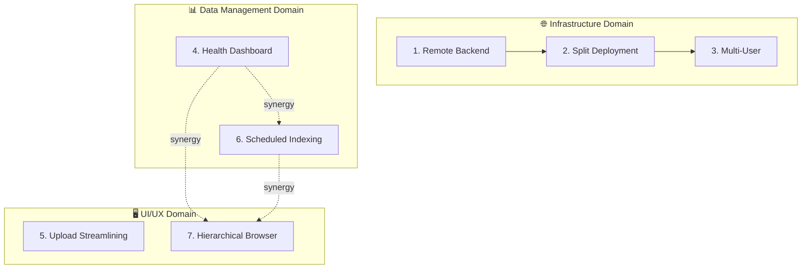

# Feature Ideas & Roadmap v2

This document organizes feature ideas by **domain** and shows how they interrelate. Features within the same domain share concepts and can be implemented together for synergy.

---

## 🗺️ Feature Relationship Map



---

## 📋 Implementation Priority Matrix

| Priority | Feature | Dependencies | Effort | Unlocks |
|----------|---------|--------------|--------|---------|
| 🥇 **High** | #4 Health Dashboard | None | ~7-9h | Foundation for #6, #7 |
| 🥇 **High** | #1 Remote Backend | None | ~4-6h | Foundation for #2, #3 |
| 🥈 Medium | #6 Scheduled Indexing | None (uses #4) | ~12-15h | Automated workflows |
| 🥈 Medium | #7 Hierarchical Browser | None (uses #4) | ~10-13h | Better navigation |
| 🥉 Lower | #5 Upload Streamlining | None | ~3-5h | UI polish |
| 🥉 Lower | #2 Split Deployment | #1 | ~6-10h | Server separation |
| 🥉 Lower | #3 Multi-User | #1, #2 | ~4-6h | Team sharing |

**Recommended starting points:**
- **Solo user**: #4 → #6 → #7 (data management + better UI)
- **Team deployment**: #1 → #2 → #3 (infrastructure first)

---

## 🌐 Infrastructure Domain

These features address **where** the backend runs and **who** can connect.

### 1. Remote Backend Support
**Effort**: ~4-6 hours | **Dependencies**: None

Allow the desktop app to connect to a backend on a different machine.

**Key Changes:**
- Add "Backend URL" setting in Settings tab
- Toggle between "Local Docker" vs "Remote Server" mode
- Hide Docker controls in Remote mode

**Unlocks**: #2 Split Deployment, #3 Multi-User

---

### 2. Split Deployment Support
**Effort**: ~6-10 hours | **Dependencies**: #1

Separate Docker backend (server) from desktop UI (clients).

**Key Deliverables:**
- `server-setup.sh` for Linux/macOS/NAS
- Modified bootstrap script with `--remote-backend` flag
- WSL-based setup for Windows servers

---

### 3. Multi-User Support
**Effort**: ~4-6 hours | **Dependencies**: #1, #2

Multiple desktop clients sharing one backend.

**Already Works**: Search, list, view (read-only operations)  
**Needs Work**: Better error handling, "last refreshed" indicators, optional auth

---

## 📊 Data Management Domain

These features address **tracking** indexed content and **automating** updates.

### 4. Indexing Health Dashboard ⭐ Foundation
**Effort**: ~7-9 hours | **Dependencies**: None

Answer: "Is my knowledge up to date?"

**Core Data Model:**
```sql
CREATE TABLE indexing_runs (
    id UUID PRIMARY KEY,
    started_at TIMESTAMPTZ,
    completed_at TIMESTAMPTZ,
    status TEXT,  -- 'running', 'success', 'partial', 'failed'
    files_scanned INT,
    files_added INT,
    files_updated INT,
    errors JSONB
);
```

**Why Foundation**: Provides run tracking that #6 and #7 leverage.

---

### 6. Scheduled Automatic Indexing
**Effort**: ~12-15 hours | **Dependencies**: None (synergizes with #4)

Maintain a list of "watched folders" with periodic scans.

**Core Data Model:**
```sql
CREATE TABLE watched_folders (
    id UUID PRIMARY KEY,
    root_path TEXT NOT NULL,
    schedule TEXT DEFAULT 'daily',
    enabled BOOLEAN DEFAULT TRUE,
    last_scanned_at TIMESTAMPTZ
);
```

**Key Insight**: Scheduler runs where files are (desktop for local files).

**UI Features:**
- Watched folders list (add/remove/enable/disable)
- Per-folder schedule settings
- "Scan Now" button
- Status indicators

**Synergy with #4**: Uses run tracking for history/status display.

---

## 🖥️ UI/UX Domain

These features improve **navigation** and **workflow**.

### 7. Hierarchical Document Browser
**Effort**: ~10-13 hours | **Dependencies**: None (synergizes with #4, #6)

Replace flat document list with folder tree navigation.

**Proposed UX:**
```
📁 C:\Documents (1,234 files, Last updated: Jan 8)
   ├── 📁 Projects (456 files)
   │   └── 📄 report.pdf
   └── 📁 Personal (778 files)
```

**Key Changes:**
- `GET /documents/tree` API endpoint
- `QTreeWidget` instead of `QTableWidget`
- Aggregated counts/timestamps per folder

**Synergy with #4**: Uses timestamps from run tracking.  
**Synergy with #6**: Shows watched folder roots prominently.

---

### 5. Upload Tab UI Streamlining
**Effort**: ~3-5 hours | **Dependencies**: None

Simplify upload workflow.

**Changes:**
- Make "Index Folder" the primary action
- Show "Last Indexed" timestamp per folder
- Minimize "Index File" button (secondary option)

---

## 🔗 Synergy Opportunities

| Combination | Synergy |
|-------------|---------|
| #4 + #6 | Health dashboard shows scheduled run history |
| #4 + #7 | Tree view shows timestamps from run data |
| #6 + #7 | Tree view highlights watched folder roots |
| #1 + #4 | Remote dashboard shows server-side status |

---

## ✅ Implemented Features

*(Move completed features here)*

---

## 🗑️ Rejected/Deferred Ideas

*(Move declined features here)*

---

*Last updated: 2026-01-10*
