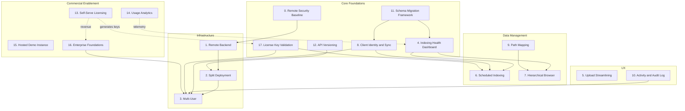

# Feature Ideas & Roadmap v5

This revision builds on v4 by introducing the **Edition Model** (Community vs Team), replacing the insecure config-based edition switch with **license key validation**, refining execution sequencing, and incorporating feedback on analytics messaging, SSO scope, and demo/SaaS positioning.

---

## Guiding Principles

1. Remote mode must be secure by default (auth + TLS, no open unauthenticated server).
2. Scheduling runs where the files are (desktop), but the server owns canonical state.
3. Multi-user requires explicit tenancy and audit trails, not just shared access.
4. UX improvements should leverage the same telemetry and data model.
5. **Revenue-critical features (team deployment path) must not be deprioritized below solo-user polish.**
6. **Every new table requires a migration path. No raw `CREATE TABLE` without Alembic.**
7. **API changes must be versioned to support mixed client/server versions.**
8. **The edition (Community vs Team) is derived from a license key, never from a config file.**
9. **SSO and enterprise features are built on-demand (when a paying customer requests them), not speculatively.**
10. **Local-only by design: no hosted indexing or storage.**

---

## Edition Model

The product ships as **one codebase, one binary, two editions** — determined at runtime by the presence and validity of a license key.

| | **Community Edition** | **Team Edition** |
|---|---|---|
| **Target** | Individuals, hobbyists, students, small teams (1-3) | Teams, organizations, enterprises |
| **Install** | One-click installer, no Docker knowledge needed | Docker Compose / server setup |
| **Mode** | Local-only, single user | Remote backend, multi-user, split deployment |
| **Features** | Search, index, upload, browse, health dashboard | + Scheduling, audit log, client identity, RBAC (Phase 1), SSO (on-demand/Enterprise) |
| **Price** | Free (Community License) | Paid (Commercial License) |
| **Purpose** | Onboarding funnel, word-of-mouth, brand building | Revenue |

### How it works

- On startup, the app checks for a license key file at a platform-specific path:
  - **Linux**: `~/.pgvector-license/license.key`
  - **macOS**: `~/.pgvector-license/license.key`
  - **Windows**: `%APPDATA%\PGVectorRAGIndexer\license.key`
- **No key or invalid key** → Community Edition (all local/solo features enabled, team features hidden)
- **Valid key** → Team Edition (all features enabled, edition/expiry shown in Settings tab)
- The license key is a **signed token** (HMAC-SHA256 JWT, HS256) encoding: edition, org name, seat count, expiry date. RSA signing deferred until third-party verification is needed.
- Keys cannot be forged without the signing secret
- **Optional online validation**: on startup, ping a lightweight license endpoint to check revocation. Graceful fallback to offline validation if no internet.
- The edition is **never stored in config.py or .env** — it is always computed from the license key at runtime

### Why this model works commercially

1. **Low barrier**: The "nontechnical individual" installs it, loves it, tells colleagues
2. **Bottom-up adoption**: Individual users become internal champions who push for team licenses
3. **The free edition IS the demo**: No separate hosted demo needed for basic evaluation (though #15 still helps for zero-install first impressions)
4. **No maintenance burden**: One codebase, one test suite, one release pipeline
5. **Clear upgrade path**: "You're already using it. Now your whole team can."
6. **No punitive gating**: Community edition feels complete for solo use. Search, index, browse, health dashboard — all free.

### Edition Gating Policy

Community features remain fully functional and unrestricted; Team features are hidden or disabled without a valid license. Gating is a **feature boundary**, not a legal enforcement mechanism — the Community License (`LICENSE_COMMUNITY.txt`) defines legal terms; the edition gate defines the product experience.

**UI treatment of gated features**: Team-only features should not simply disappear. Instead, show locked-feature placeholders with a brief explanation: *"🔒 Team feature — requires a license. [Learn more]"* linking to the pricing page. This educates users about what they're missing and creates natural upgrade prompts without being intrusive.

### Precedents

Obsidian (free personal, paid sync/publish), JetBrains (community vs ultimate), Sublime Text (free eval, paid license), GitLab (CE vs EE).

---

## API Key vs License Key

The product uses two distinct "keys" for different purposes. They must not be confused in documentation, UI, or user communication.

| | **API Key** | **License Key** |
|---|---|---|
| **Purpose** | Authenticates a client to the server (who can connect) | Determines the edition (what features are available) |
| **Introduced by** | #0 Remote Security Baseline | #17 License Key Validation |
| **Where it lives** | Sent as HTTP header on every API request | Stored in a local file, read on app startup |
| **Who generates it** | Server admin (or auto-generated during setup) | Stripe webhook / manual sales process |
| **Scope** | Per-server, per-user (in multi-user mode) | Per-organization |
| **Required when** | Remote mode (always); local mode (never) | Team edition features desired |
| **Format** | Random token (e.g., `pgv_sk_abc123...`) | Signed JWT with edition, org, seats, expiry |

**In the UI**, these should appear in separate Settings sections: "Server Connection" (API key) and "License" (license key). Never combine them into a single "keys" panel.

---

## Feature Relationship Map



---

## Implementation Priority and Sequencing

### Immediate Actions (Parallel)

These two have **zero dependency on each other** and should start simultaneously:

| Feature | Track | Effort | Why now |
|---------|-------|--------|---------|
| **#11 Schema Migration Framework** | Tech | ~4-6h | True blocker. Cannot build any new data feature without it. |
| **#13 Self-Serve Licensing** | Commercial | ~8-12h | Highest ROI. A pricing page with Stripe generates revenue before the product is team-ready. Even a "Coming soon — reserve your license" page captures intent. Lives in the website repo — no conflict with #11. |

### Phase 1: Security, Versioning, and Licensing Foundation

| Feature | Track | Effort | Why next |
|---------|-------|--------|----------|
| **#0 Remote Security Baseline** | Tech | ~8-12h | Gate to the entire team/revenue path. |
| **#17 License Key Validation** | Tech | ~6-8h | Edition model enforcement. Needed before any team-only feature ships. |
| **#12 API Versioning** | Tech | ~3-5h | Must land before any remote/split deployment. If remote ships without versioning, mixed client/server versions will break silently. |
| **#4 Indexing Health Dashboard** | Tech | ~7-9h | Foundation for #6, #7, #10. Available in Community edition. |

### Phase 2: Team Enablement

| Feature | Track | Effort | Why |
|---------|-------|--------|-----|
| **#1 Remote Backend Support** | Tech | ~4-6h | Unlocks #2, #3. Ships with versioning (#12) already in place. |
| **#8 Client Identity and Sync** | Tech | ~8-12h | Required for multi-user and scheduling |
| **#15 Hosted Demo Instance** | Commercial | ~6-10h | Reduces onboarding friction |

### Phase 3: Automation and Navigation

| Feature | Track | Effort | Why |
|---------|-------|--------|-----|
| **#6 Scheduled Indexing** | Tech | ~14-20h | Team edition feature, requires background service |
| **#6b Server-First Automation Profile** | Tech | ~8-14h | Required when watched roots live on server/mounted shares |
| **#9 Path Mapping (Virtual Roots)** | Tech | ~6-10h | Required for #7 in remote setups |
| **#7 Hierarchical Browser** | Tech | ~12-16h | Major UX improvement, available in both editions |
| **#10 Activity and Audit Log** | Tech | ~6-10h | Required for #3 |

### Phase 4: Multi-User and Enterprise

| Feature | Track | Effort | Why |
|---------|-------|--------|-----|
| **#2 Split Deployment** | Tech | ~6-10h | Server separation |
| **#3 Multi-User** | Tech | ~20-30h | Team edition flagship. Only after all dependencies are solid. |
| **#14 Usage Analytics** | Commercial | ~6-10h | Data-driven prioritization (by now you have real users to learn from) |
| **#16 Enterprise Foundations** | Commercial | ~15-25h | Only when a paying customer requests SSO/RBAC |

### Lower Priority (Any Time)

| Feature | Track | Effort | Why |
|---------|-------|--------|-----|
| **#5 Upload Streamlining** | Tech | ~3-5h | UI polish, no dependencies, do whenever convenient |

### Recommended Starting Points (Summary)

- **Solo user improvements**: #11 → #4 → #7 → #5
- **Team deployment**: #11 + #13 (parallel) → #0 → #17 → #12 → #1 → #8 → #2 → #10 → #3
- **Revenue**: #13 → #15 → #14 → #16

---

## Core Foundations

### 0. Remote Security Baseline
**Effort**: ~8-12h | **Dependencies**: None | **Edition**: Both (enables Team features)

Make remote mode safe by default. Mitigates the biggest commercial and technical risk.

**Why non-negotiable**: Shipping a remote mode without auth is a CVE generator. An unauthenticated API exposed to a network is not a missing feature — it is a liability. This is essential risk management, not optional hardening.

Key changes:
- Require API keys for any remote backend (no unauthenticated mode)
- TLS support (self-signed guide + reverse proxy notes)
- Explicit allow-list of origins and hosts
- Add "Remote mode" warning banner with server URL and auth status

Deliverables:
- `API_KEY` auth middleware in FastAPI
- Config validation to block remote URL without API key
- Quickstart docs for reverse proxy (Caddy or Nginx)

**API key lifecycle management**:
- **Create**: Admin generates keys via CLI (`pgvector-admin create-key --name "Alice"`) or Settings UI. Keys are prefixed (`pgv_sk_`) for easy identification.
- **List**: Admin can view all active keys with name, creation date, and last-used timestamp.
- **Revoke**: Admin can revoke a key immediately. Revoked keys are rejected on next request.
- **Rotate**: Admin can rotate a key (generates new key, old key remains valid for a grace period of 24h, then auto-revokes).
- **Storage**: Keys are stored **hashed** (SHA-256) server-side. The plaintext key is shown only once at creation time.
- **Scope**: In multi-user mode (#3), each user gets their own API key. In single-user remote mode, one key suffices.

---

### 4. Indexing Health Dashboard
**Effort**: ~7-9h | **Dependencies**: #11 | **Edition**: Community + Team

Answer: "Is my knowledge up to date?"

Core data model (via Alembic migration):
```sql
CREATE TABLE indexing_runs (
    id UUID PRIMARY KEY,
    started_at TIMESTAMPTZ,
    completed_at TIMESTAMPTZ,
    status TEXT,  -- 'running', 'success', 'partial', 'failed'
    files_scanned INT,
    files_added INT,
    files_updated INT,
    errors JSONB
);
```

Why foundation: Provides run tracking that #6, #7, #10, and #14 leverage.

---

### 8. Client Identity and Sync
**Effort**: ~8-12h | **Dependencies**: #4, #11 | **Edition**: Team

Introduce explicit client identity so the server can track which desktop performed scans and uploads.

Key changes:
- Client registration on first run (client_id + device name + OS info)
- Per-run attribution: client_id stored in indexing_runs
- "Last seen" status for clients in UI

Core data model (via Alembic migration):
```sql
ALTER TABLE indexing_runs ADD COLUMN client_id TEXT;

CREATE TABLE clients (
    id TEXT PRIMARY KEY,
    display_name TEXT,
    os_type TEXT,          -- 'windows', 'macos', 'linux'
    app_version TEXT,      -- for compatibility tracking
    last_seen_at TIMESTAMPTZ
);
```

Why it matters:
- Enables scheduling (#6) without confusion
- Required for multi-user auditability (#3, #10)
- `os_type` feeds into #9 (Path Mapping) for cross-platform path resolution

---

### 11. Schema Migration Framework
**Effort**: ~4-6h | **Dependencies**: None | **Edition**: Both

**Problem**: Features #4, #6, #8, #10 all introduce new tables. The project currently uses `init-db.sql` for schema setup. Existing users upgrading have no migration path — they would need to manually alter their database or lose data.

**Why non-negotiable**: Without migrations, every schema change is a breaking change. This is not a feature — it is infrastructure debt that blocks all data-layer work. Shipping new tables without it risks data loss for existing users.

Key changes:
- Add Alembic to `requirements.txt`
- Create `alembic/` directory with initial migration from current `init-db.sql` schema
- Auto-run pending migrations on app startup (both Docker and desktop)
- `alembic upgrade head` in Docker entrypoint
- Desktop app checks and applies migrations before connecting
- **Pre-migration safety**: Before running any migration, the app checks for a recent backup. If no backup exists within the last 24h, the app prompts the user: "Database migration required. No recent backup found. [Back up now] [Skip backup and migrate] [Cancel]." Docker mode runs `pg_dump` automatically before migrating. This prevents data loss if a migration fails on the user's only database.

Deliverables:
- `alembic.ini` + `alembic/env.py` + `alembic/versions/` directory
- Migration for current schema (baseline)
- Documentation for contributors on creating new migrations

Testing:
- Test migration on a real v2.4 database with existing data
- Test fresh install (baseline + all migrations)
- Test idempotency (running migrations twice does nothing)

Why critical: Without this, every new table is a breaking change for existing users. **This must land before #4.**

---

### 12. API Versioning
**Effort**: ~3-5h | **Dependencies**: None | **Edition**: Both

**Problem**: Once #1 and #2 enable remote/split deployment, clients and servers may run different versions. A v2.5 desktop talking to a v2.4 server (or vice versa) will break silently.

Key changes:
- Add `/api/v1/` prefix to all endpoints (keep `/` redirecting to v1 for backward compat)
- `GET /api/version` returns:
  ```json
  {
    "server_version": "2.5.0",
    "api_version": "v1",
    "min_client_version": "2.4.0",
    "max_client_version": "2.6.x"
  }
  ```
- Desktop app checks version on connect, warns if incompatible
- Document versioning policy: new endpoints go in current version, breaking changes bump version
- Maintain a **compatibility matrix** in docs (which client versions work with which server versions) to avoid lock-step release requirements
- **Ownership**: The compatibility matrix is updated as part of the release checklist. Every release that changes API endpoints or data models must update the matrix before merge to `main`. This is enforced by a PR template checkbox.

---

### 17. License Key Validation (New)
**Effort**: ~6-8h | **Dependencies**: #11 (server_settings table requires Alembic migration) | **Edition**: Both (this IS the edition gate)

**Problem**: The edition model needs enforcement. A config file switch (`EDITION = "team"` in config.py) is trivially bypassable and defeats the licensing model.

Architecture:
- License key file (platform-specific):
  - **Linux/macOS**: `~/.pgvector-license/license.key` (permissions: `600`, user-only readable)
  - **Windows**: `%APPDATA%\PGVectorRAGIndexer\license.key` (installer sets ACL to user-only read; no other users or services can access)
- Key format: signed JWT (HMAC-SHA256) containing:
  ```json
  {
    "edition": "team",
    "org": "Acme Corp",
    "seats": 10,
    "exp": "2027-02-09",
    "issued_at": "2026-02-09"
  }
  ```
- Signing secret is compiled into the release binary / kept server-side for key generation
- Validation logic in a dedicated `license.py` module (not in config.py)
- On startup:
  1. Look for license key at the platform-specific path (see above)
  2. If missing → Community edition
  3. If present → validate signature, check expiry
  4. If valid → enable Team features, show edition info in Settings
  5. If expired/invalid → Community edition + warning banner
- **Optional online check**: ping `https://license.pgvectorragindexer.com/validate` to check revocation. Graceful fallback to offline validation. Never block the app if the server is unreachable.

**Revocation strategy — keep it simple**:
- **Do not build a revocation server yet.** It adds uptime/caching/latency complexity that isn't justified at launch.
- Instead, issue keys with **short expiry (e.g., 90 days)**, auto-renewed via a simple script or Stripe webhook on payment. This gives "revocation by expiration" for free — if a customer cancels, their key simply expires.
- If a refund or abuse case requires immediate revocation before expiry, handle it manually (issue a replacement key with `exp` in the past, email the customer). This covers edge cases without infrastructure.
- **Revisit** a proper revocation server only when the volume of cancellations/refunds justifies the engineering cost (likely 100+ active licenses).

**Offline / air-gapped operation**: The signed JWT contains the expiry date (`exp`) inside the token itself. The app validates expiry by comparing against the local system clock — no network call is ever required. This guarantees 100% offline operation for enterprise environments that prohibit outbound connections. The optional online check is strictly for revocation (e.g., refunded licenses) and is never mandatory.

Graceful degradation on license expiry:

**Admin client definition**: The "admin client" is the client whose `client_id` matches the `owner_client_id` stored in the server's `server_settings` table (created during initial setup). This is set once during first server configuration and can be reassigned by anyone with direct database access. It is NOT derived from "first registered" — it is an explicit, auditable setting.

```sql
CREATE TABLE server_settings (
    key TEXT PRIMARY KEY,
    value TEXT NOT NULL
);
-- Initial row: ('owner_client_id', '<client_id of the setup client>')
```

When a Team license expires, the app does not lock data or block access:

- **Shared corpus**: Remains fully readable and searchable. No data is lost or hidden.
- **Indexing**: All write operations are blocked for ALL users (including admins). This is simpler and more secure than role-based expiry exceptions.
- **Watched folders / scheduling**: Background scheduling pauses.
- **Activity log**: Continues recording.
- **Banner**: All clients show a persistent (non-blocking) banner: "Team license expired on [date]. Renew at [pricing page URL]. Read access continues; write access is blocked."
- **Goal**: Never hold data hostage. The worst case is a graceful read-only fallback, not a lockout.

UI changes:
- Settings tab: "License" section showing edition, org, expiry, seat count
- "Enter License Key" button (paste or browse for .key file)
- Community edition: subtle "Upgrade to Team" link (opens pricing page)

What it does NOT do:
- Does not phone home on every launch (only optional, graceful)
- Does not require internet access — ever. The JWT is fully self-contained for offline/air-gapped environments.
- Does not disable the app if the license expires (graceful read-only fallback, see above)
- Does not lock or hide data created under a Team license
- Does not nag or interrupt workflow

Key generation:
- #13 (Self-Serve Licensing) generates keys via Stripe webhook → key generation service
- Manual key generation script for direct sales

---

## Infrastructure

### 1. Remote Backend Support
**Effort**: ~4-6h | **Dependencies**: #0 | **Edition**: Team

Allow the desktop app to connect to a backend on a different machine.

Key changes:
- Add "Backend URL" setting in Settings tab
- Toggle between "Local Docker" vs "Remote Server"
- Hide Docker controls in Remote mode
- Require API key for remote URLs (enforced by #0)

Unlocks: #2 Split Deployment, #3 Multi-User

---

### 2. Split Deployment Support
**Effort**: ~6-10h | **Dependencies**: #1, #0, #12 | **Edition**: Team

Separate Docker backend (server) from desktop UI (clients).

**Server Platform Support Matrix**:

| Platform | Server Support | Notes |
|----------|---------------|-------|
| **Linux** (Docker) | **Supported** | Primary target. `server-setup.sh` provided. |
| **macOS** (Docker Desktop) | **Supported** | Works but not recommended for production (Docker Desktop licensing). |
| **Windows** (WSL2 + Docker) | **Supported** | WSL2-based setup script provided. |
| **Windows** (bare Python) | **Not supported** | pgvector native build on Windows is fragile. Do not attempt. |
| **NAS** (Synology/QNAP Docker) | **Best-effort** | Community-tested, not officially supported. |

**Desktop client** (connects to server): Supported on Windows, macOS, and Linux — no Docker required on the client side.

Key deliverables:
- `server-setup.sh` for Linux/macOS/NAS
- Modified bootstrap script with `--remote-backend` flag
- WSL-based setup for Windows servers
- Clear support boundaries (the matrix above, included in deployment docs)
- Version compatibility check on client connect (via #12)

**Server-side CLI (already exists)**: The project already ships CLI tools for headless/server-side use — no desktop GUI required for server-local indexing:
- `python indexer_v2.py index /path/to/doc` — index a single document
- `python indexer_v2.py list` / `delete` / `stats` — manage documents
- `python retriever_v2.py "query"` — search from the command line
- `python scripts/reindex_all.py` — batch reindex all documents
- `mcp_server.py` — MCP protocol for AI agent integration

This means a team with 1TB of PDFs on a NAS can index them directly on the server without pushing files over the network through a desktop client.

---

### 3. Multi-User Support
**Effort**: ~20-30h | **Dependencies**: #1, #2, #8, #10, #17 | **Edition**: Team

Multiple desktop clients sharing one backend. **Phase-gated to control scope.**

**Phase 1 — Shared corpus** (~12-16h):
- API key authentication (per-user keys)
- Per-client identity and last seen status (via #8)
- Conflict-safe indexing: server-side write lock per document
  - Optimistic concurrency control: version column on documents table
  - Lock storage: `document_locks` table with `source_uri`, `client_id`, `locked_at`, and a **TTL** (default 10 minutes). Locks auto-expire if a client dies or disconnects, preventing deadlocks.
  - Use PostgreSQL advisory locks as a lightweight alternative for short operations; `document_locks` table for long-running indexing jobs.
  - Clear error: "Document X is being indexed by Client Y (lock expires in N minutes)"
- Auditable activity log (via #10)
- All users see all documents (shared corpus)

**Phase 2 — User scoping** (8-14h, only if paid demand exists):
- Per-user document visibility
- Shared vs. private document spaces
- Admin role for managing users and viewing all activity

**Phase 3 — Enterprise auth** (via #16, only when a paying customer requests it):
- SSO/SAML integration
- RBAC with custom roles

Testing requirements:
- Concurrent write tests (multiple clients indexing simultaneously)
- Conflict resolution tests
- Permission boundary tests (Phase 2+)

---

## Data Management

### 6. Scheduled Automatic Indexing
**Effort**: ~14-20h | **Dependencies**: #4, #8 | **Edition**: Team

Maintain a list of watched folders with periodic scans, executed on the client.

**Background service architecture** (scheduler must survive the app being closed):
- **Linux**: systemd user service (`~/.config/systemd/user/pgvector-scheduler.service`)
- **macOS**: launchd plist (`~/Library/LaunchAgents/com.pgvector.scheduler.plist`)
- **Windows**: Windows Task Scheduler task (created by installer)
- Service is a thin Python script that reads watched_folders config and calls the indexing API
- **Fallback**: In-app scheduler (QTimer-based) for users who don't want a background service
- Desktop app UI manages the schedule; the service executes it

Implementation strategy: Start with **one OS** (Linux systemd), validate the approach, then add macOS and Windows.

Core data model (via Alembic migration):
```sql
CREATE TABLE watched_folders (
    id UUID PRIMARY KEY,
    root_path TEXT NOT NULL,
    virtual_root TEXT,           -- links to #9 Path Mapping
    schedule TEXT DEFAULT 'daily',
    enabled BOOLEAN DEFAULT TRUE,
    last_scanned_at TIMESTAMPTZ,
    client_id TEXT NOT NULL
);
```

UI features:
- Watched folders list (add/remove/enable/disable)
- Per-folder schedule settings
- "Scan Now" button
- Status indicators by client
- Toggle: "Run as background service" vs "Run only while app is open"
- Service status indicator (running/stopped/not installed)

### 6b. Server-First Automation Profile (when files live on server storage)
**Effort**: ~8-14h | **Dependencies**: #6, #9, #10, #11 | **Edition**: Team

When folders are on server disks or server-mounted shares, indexing must run server-side on a schedule. This profile extends #6 with explicit source partitioning and conflict safety for mixed environments (server roots + desktop-local roots).

Source ownership and partitioning rules:
- Every watched root has an explicit execution scope: `client` or `server`.
- `client` scope: scanned by desktop scheduler with that `client_id`.
- `server` scope: scanned by server scheduler; `client_id` is NULL and `executor_id` is NULL.
- A root cannot be both `client` and `server` scope at the same time.
- Scope changes (`client <-> server`) must use an explicit transition API and happen as in-place updates (same row/root identity).

Compatibility and rollout constraints (must-haves):
- Backward compatibility first: existing installs default to `execution_scope='client'` and continue desktop-only behavior.
- Server scheduler is opt-in (disabled by default).
- Existing desktop clients can keep using current watched-folder flows without breakage.
- No Phase 4b dependency: this feature must ship independently of DB-backed roles/compliance work.

Canonical identity and dedupe rules (Phase 6b.2, deferred from MVP):
- Add `canonical_source_key` to each indexed document/chunk metadata.
- `canonical_source_key` format:
  - client scope: `client:<client_id>:<normalized_path>`
  - server scope: `server:<root_id>:<normalized_path>`
- Deduplicate by `canonical_source_key` first, then content hash.
- Content-hash dedupe is OFF by default — enable per-root to avoid surprising behavior.
- If same content appears under different keys, keep separate records unless admin enables cross-root dedupe.

Conflict resolution rules:
- If two schedulers claim the same root, server scheduler wins for `server` scope and client scheduler wins for `client` scope.
- Writes from wrong scope are rejected with explicit 409 message.
- Locking remains TTL-based (`document_locks`) but lock key is upgraded from `source_uri` to `(root_id, relative_path)` for scheduler safety (Phase 6b.2).

Server scheduler runtime model (MVP):
- Run scheduler in-process on the API server, guarded by a DB advisory lock (deterministic lock ID: `2050923308` = CRC32 of `pgvector_server_scheduler`) so only one active scheduler loop runs.
- Do not require distributed scheduler election for this phase.
- Add explicit env toggle: `SERVER_SCHEDULER_ENABLED` (default false).
- **Critical: async scan execution.** `scan_folder()` is synchronous (`os.walk` + `DocumentIndexer`). The server scheduler must wrap calls with `asyncio.to_thread()` to avoid blocking the API event loop.

Desktop scheduler amendments (MVP):
- `FolderScheduler._check_folders()` must filter by scope and executor ownership — skip any root where `execution_scope != 'client'` or `executor_id != self._client_id`.
- Alternatively, the desktop scheduler should call `list_watched_folders(execution_scope='client', executor_id=<client_id>)` so the server returns only relevant roots.

Filesystem access requirements:
- Server-scope roots require that the folder path is accessible from the API server process filesystem.
- Docker deployments: source directories must be bind-mounted into the container.
- Bare-metal deployments: the path must be readable by the API process user.
- `POST /watched-folders` should validate that the path exists on the server when `execution_scope='server'` (fail fast vs failing silently during first scan).

Safety controls required:
- Dry-run mode: scan and report planned adds/updates/deletes without writing.
- Delete policy: soft-delete first (quarantine window, e.g. 7 days), then hard-delete (Phase 6b.3, deferred from MVP).
- Scan watermark per root (`last_scan_started_at`, `last_scan_completed_at`, `last_successful_scan_at`).
- Root health state (`healthy`, `degraded`, `error`) with backoff and retry policy.
- Per-root concurrency cap (default 1) to avoid duplicate scans.

Operational observability:
- Activity log must record `executor_scope` (`client`/`server`), `executor_id`, root id, and run id.
- New API endpoint for scheduler status by root (next run, last run, error streak).
- Admin UI panel to view/force-pause/resume server-scope roots.

Migration updates required:
- Extend `watched_folders`:
  - `execution_scope TEXT NOT NULL DEFAULT 'client' CHECK (execution_scope IN ('client','server'))`
  - `executor_id TEXT NULL` (`client_id` for client scope, `NULL` for server scope)
  - `normalized_folder_path TEXT NOT NULL` (normalized path key for scoped uniqueness)
  - `CHECK` invariant: `client => executor_id IS NOT NULL`, `server => executor_id IS NULL`
  - `root_id UUID NOT NULL` (stable scheduler root identity)
  - `last_error_at TIMESTAMPTZ`, `consecutive_failures INT DEFAULT 0`
- Backfill existing rows with `execution_scope='client'`, `executor_id=client_id`, generated `root_id`.
- Add `canonical_source_key` as a real indexed field (Phase 6b.2, not in MVP migration).
- Replace global unique `folder_path` with scoped unique indexes on normalized path:
  - partial unique `(executor_id, normalized_folder_path)` where `execution_scope='client'`
  - partial unique `(normalized_folder_path)` where `execution_scope='server'`
- Add indexes:
  - `(execution_scope, enabled, schedule_cron)`
  - `(root_id, execution_scope)`

API/versioning notes:
- Keep changes additive under `/api/v1`.
- New fields on watched-folder payloads are optional and default-safe.
- `GET /watched-folders` must support `execution_scope` and `executor_id` query filter params so both schedulers can efficiently query only their relevant roots.
- Expose scheduler capability flags/status endpoints without breaking old clients.

Recommended delivery sequence:
1. MVP: scope partitioning + server scheduler (async) + desktop scope filtering + API filter params + filesystem validation + status/pause/resume/scan-now + 409 protection.
2. Identity hardening: canonical key + lock key migration.
3. Safety polish: quarantine lifecycle (if needed after MVP).

Non-goals for this phase:
- Cross-tenant global dedupe.
- Distributed scheduler cluster election across multiple API replicas (single active scheduler is sufficient initially).

---

### 7. Hierarchical Document Browser
**Effort**: ~12-16h | **Dependencies**: #4, #9 | **Edition**: Community + Team

Replace flat document list with folder tree navigation. Must handle large document sets (50K+ files).

Key changes:
- `GET /documents/tree` API endpoint, keyed by virtual root
  - **Paginated**: returns one level at a time (lazy loading)
  - **Cached**: server-side cache with TTL, invalidated on index operations
- `QTreeView` with custom model (NOT `QTreeWidget`) for lazy/virtual loading
  - Expand-on-demand: child nodes fetched when parent is expanded
  - Background loading with progress indicator
- Aggregated counts/timestamps per folder (computed server-side, cached)
- Search-within-tree: filter tree to show only matching paths

---

### 9. Path Mapping / Virtual Roots
**Effort**: ~6-10h | **Dependencies**: #1 | **Edition**: Team

Avoid confusing absolute paths across machines by introducing named roots.

Example:
- `FinanceDocs` → `C:\Finance` (client A, Windows)
- `FinanceDocs` → `/mnt/finance` (client B, Linux)

Data model (via Alembic migration):
```sql
CREATE TABLE virtual_roots (
    name TEXT PRIMARY KEY,
    client_id TEXT NOT NULL,
    local_path TEXT NOT NULL,
    UNIQUE(name, client_id)
);
```

UX consideration: Path mapping must feel intuitive. When a user adds a watched folder, prompt them to name it. Show the virtual name prominently in the tree view. For local path visibility, provide a **"Show local paths" toggle** in the tree view toolbar (default off) and a **Details panel** that appears when a virtual root is selected, showing all client mappings. Tooltip-only is too restrictive — users need a way to verify and audit mappings without digging into settings.

Benefits:
- Remote and multi-user deployments remain readable
- Folder tree is stable across OS and machines
- Resolves the cross-platform path problem for `watched_folders.root_path`

---

## UX

### 5. Upload Tab UI Streamlining
**Effort**: ~3-5h | **Dependencies**: None | **Edition**: Community + Team

Simplify upload workflow.

Changes:
- Make "Index Folder" the primary action
- Show "Last Indexed" timestamp per folder
- Minimize "Index File" button (secondary option)

---

### 10. Activity and Audit Log
**Effort**: ~6-10h | **Dependencies**: #4, #11 | **Edition**: Team

Track who indexed what and when for trust and debugging.

Data model (via Alembic migration):
```sql
CREATE TABLE activity_log (
    id UUID PRIMARY KEY,
    ts TIMESTAMPTZ NOT NULL DEFAULT NOW(),
    client_id TEXT,
    user_id TEXT,           -- for multi-user (#3)
    action TEXT,            -- 'index_start', 'index_complete', 'delete', 'upload', 'search'
    details JSONB
);

CREATE INDEX idx_activity_log_ts ON activity_log (ts DESC);
CREATE INDEX idx_activity_log_client ON activity_log (client_id);
```

UI:
- Recent activity panel (filter by client, user, and action)
- Export to CSV
- Retention policy setting (auto-delete logs older than N days)

---

## Commercial Enablement

These features don't improve the product technically but directly drive revenue. They should be developed **in parallel** with the technical track.

### 13. Self-Serve Licensing
**Effort**: ~8-12h | **Dependencies**: None (website project) | **Edition**: N/A (website)

**Problem**: Every commercial license sale currently requires email negotiation. Prospects who would pay $200/year will not send an email to a stranger.

Key changes:
- Pricing page on the website with clear tiers:
  - **Community**: Free — personal use, education, research
  - **Team** (2-10 users): $X/year
  - **Organization** (11-50 users): $Y/year
  - **Enterprise** (50+): Contact us
- Stripe Checkout integration for Team and Organization tiers
- License key generation via Stripe webhook → signing service → email delivery
- License key validation in the app (via #17)
- FAQ page addressing common procurement questions

**Minimum viable version**: Even before Stripe is wired up, a pricing page with "Reserve your license — email us" captures intent and validates pricing. Ship this first, automate later.

**Key insight**: You can sell the potential before the product is team-ready. A pricing page with clear tiers signals commercial seriousness, lets prospects budget internally, and captures purchase intent — even if the Team edition features are still in development. Every week without a "Buy" button is lost revenue from users who are already evaluating.

Where it lives: `PGVectorRAGIndexerWebsite` project.

---

### 14. Usage Analytics
**Effort**: ~6-10h | **Dependencies**: #4 (optional) | **Edition**: Both (opt-in)

**Problem**: Zero visibility into usage patterns. All prioritization is guesswork.

**Privacy-first implementation** (critical for brand trust):
- **Opt-in only**, off by default
- First-run dialog: clear, honest, one sentence — "Help improve PGVectorRAGIndexer by sharing anonymous usage data. You can review exactly what's sent and turn this off at any time."
- **Fully auditable**: Settings tab shows a log of every event that would be sent
- **Self-hosted collector preferred** (PostHog self-hosted or simple custom endpoint), not Google Analytics
- No PII, no document content, no file names, no search queries
- Events: install, first index, first search, daily active use, errors, feature usage, OS/version
- **"What we collect" page**: Publish a page on the website showing a live example payload (sanitized JSON) of exactly what a telemetry event looks like. This is a trust builder and reduces support questions. Example: `{"event": "daily_active", "os": "linux", "version": "2.5.0", "features_used": ["search", "index"], "error_count": 0}`

What to learn:
- Install success/failure rate and failure reasons
- Time from install to first successful search (onboarding funnel)
- Feature usage frequency (which tabs, which API endpoints)
- Error rates by category
- OS distribution, Python version, Docker version

**If this creates too much brand risk**, deprioritize it. Download counts + GitHub stars + license purchase data + support emails provide a reasonable (if imperfect) signal.

---

### 15. Hosted Demo Instance
**Effort**: ~6-10h | **Dependencies**: None | **Edition**: N/A (marketing)

**Problem**: Install barrier is high (Docker + ~2GB PyTorch). Many prospects bounce before seeing the product work.

Key changes:
- Read-only hosted instance with a pre-indexed sample corpus
- "Try it now" button on the website
- No login required for searching
- Indexing disabled (read-only)
- Banner: **"Try the search — your real data never leaves your machine."**
- Auto-reset daily

Infrastructure:
- Single small VM or container (Railway, Fly.io, or $5/mo VPS)
- Pre-built Docker image with sample data baked in
- Cost: ~$10-20/month

**Messaging discipline**: The demo is a preview of the search experience. Marketing copy must never imply the product is a cloud service. Suggested copy: *"This demo runs on our server with sample data. The real product runs entirely on yours."*

**Keep demo and licensing completely separate.** The demo must not require a license key, and the demo page must not imply that the Team edition requires cloud access. These are independent concepts: the demo shows what the product can do; the license unlocks team features on your own hardware.

**Conversion path**: The demo should include a clear, non-intrusive CTA: *"Like what you see? Install the local version to use your own data →"* linking to the install page, with a secondary link to the pricing page. This bridges demo → install → purchase without conflating the demo with a cloud service.

---

### 16. Enterprise Foundations
**Effort**: ~15-25h | **Dependencies**: #0, #8 | **Edition**: Team (enterprise tier)

**Problem**: Enterprise buyers require SSO, RBAC, and audit logs. Without these, the product is invisible to IT procurement.

**Build on-demand only.** Do not build SSO speculatively. Build it when a paying enterprise customer requests it and is willing to commit to a license.

Phase 1 (minimum viable, ~10-15h):
- **RBAC**: Admin and User roles. Admins manage users, view all activity, delete documents. Users index and search.
- **Audit log**: Leverages #10, extended with login/logout events and permission changes

Phase 2 (only when paid demand exists, ~10-15h):
- **SSO/SAML**: Integration with one provider (Okta or Azure AD). Budget extra time — SAML integration often takes longer than expected due to IdP-specific quirks.

Phase 3 (future, only if multiple enterprise customers request):
- SCIM provisioning
- Custom roles
- Data retention policies
- Compliance exports

Data model (via Alembic migration):
```sql
CREATE TABLE users (
    id TEXT PRIMARY KEY,
    email TEXT UNIQUE,
    display_name TEXT,
    role TEXT DEFAULT 'user',  -- 'admin', 'user'
    auth_provider TEXT,        -- 'api_key', 'saml'
    created_at TIMESTAMPTZ DEFAULT NOW()
);
```

---

## Synergy Opportunities

| Combination | Synergy |
|-------------|---------|
| #4 + #6 | Health dashboard shows scheduled run history |
| #4 + #7 | Tree view shows timestamps from run data |
| #6 + #7 | Tree view highlights watched folder roots |
| #0 + #1 | Secure remote mode is default |
| #8 + #3 | Multi-user without confusion or silent conflicts |
| #9 + #7 | Consistent tree view across OS |
| #10 + #3 | Auditable team usage |
| #11 + all new tables | Safe upgrades for existing users |
| #12 + #2 | Mixed client/server versions don't break |
| #13 + #17 | Self-serve purchase generates license keys |
| #14 + #15 | Demo usage data informs product priorities |
| #15 + #13 | Demo converts to purchase via pricing page |
| #17 + #3 | Edition gate prevents unauthorized team use |

---

## Risk Register

| Risk | Impact | Mitigation |
|------|--------|------------|
| Multi-user (#3) scope creep | High — could consume months | Strict phase gating: shared corpus first, user scoping only if paid demand |
| Background scheduler (#6) cross-platform bugs | Medium — different daemon models per OS | Start with one OS (Linux systemd), add others incrementally |
| Schema migrations break existing installs | High — data loss | #11 is Critical priority; test on real v2.4 databases before release |
| No revenue despite good product | High — project sustainability | Track B (Commercial) runs in parallel, not after Track A |
| Enterprise SSO (#16) over-engineered | Medium — wasted effort | Build only when a paying customer requests it. Phase 1 = RBAC only. |
| Hosted demo (#15) confused with SaaS | Medium — brand damage | Clear messaging: "Demo uses sample data. Your data stays on your machine." |
| Analytics (#14) erodes trust | Medium — user backlash | Opt-in only, fully auditable, self-hosted collector, no PII |
| License key bypass | Low — determined users will always crack it | Soft enforcement (downgrade, don't disable). The goal is to provide value, not DRM. Focus on making Team edition worth paying for, not on preventing bypass. This aligns with the local-first, trust-based brand. |
| Client/server version mismatch | Medium — silent breakage | Compatibility matrix in docs + `/api/version` with min/max client versions |
| Website repo (#13) execution risk | Medium — delays revenue | Time-box to 2 weeks. MVP = pricing page + email capture, Stripe can follow |
| Path mapping UX confusion | Medium — users feel lost | Prompt for virtual root name on folder add; show local path only in tooltips |

---

## Removed or Deferred Ideas

- **"Optional auth"** for remote or multi-user is removed. Remote mode requires auth.
- **Server-side scheduler for local files** is deferred. It causes path and access failures.
- **Cloud/SaaS hosted product** is deferred. The 100%-local positioning is a core differentiator. The hosted demo (#15) tests market appetite without committing to SaaS. Revisit only if demo usage is high and users explicitly request hosted indexing.
- **Third-party integrations** (Slack, Teams, Confluence, SharePoint, Google Drive) are deferred. Build only after multi-user (#3) and enterprise foundations (#16) are in place — integrations without team features have limited commercial value.
- **Edition switch in config.py** is rejected. Edition is derived from license key validation (#17), never from a config file.
- **"Team Lite" mode** (multi-user on a single desktop host without Docker/server setup) is deferred. If small teams stall on Docker requirements, revisit this as a lighter alternative. **Trigger condition**: revisit if >30% of commercial license inquiries cite Docker as a blocker, or if conversion data (#14) shows significant drop-off at the Docker install step.
- **"Portable Mode"** (app + index on a USB drive for air-gapped/offline use) is deferred. Fits the local-first brand and appeals to researchers/students on locked-down machines, but requires significant architecture changes (embedded DB or SQLite fallback instead of PostgreSQL). Revisit if user research shows demand from the academic/research segment.

---

## Development Practices

### Branching Strategy

- All roadmap work happens on **feature branches** (e.g., `feature/schema-migrations`, `feature/remote-security`)
- Feature branches are created from and merged back to a `develop` or `feature/roadmap-v4` integration branch
- **Merge to `main` only** when a feature is implemented, tested, and documented
- Each merge leaves `main` in a releasable state — no partial features on `main`
- Foundational features (#11, #0, #12, #17) merge first since others depend on them

### Testing Requirements

- Every new feature must include unit tests
- Migration features (#11) require integration tests against real v2.4 databases
- Multi-user features (#3) require concurrent access tests
- License validation (#17) requires tests for: valid key, expired key, missing key, tampered key, no internet (offline validation)

---

## Implemented Features

(Move completed features here)

---

Last updated: 2026-02-10
